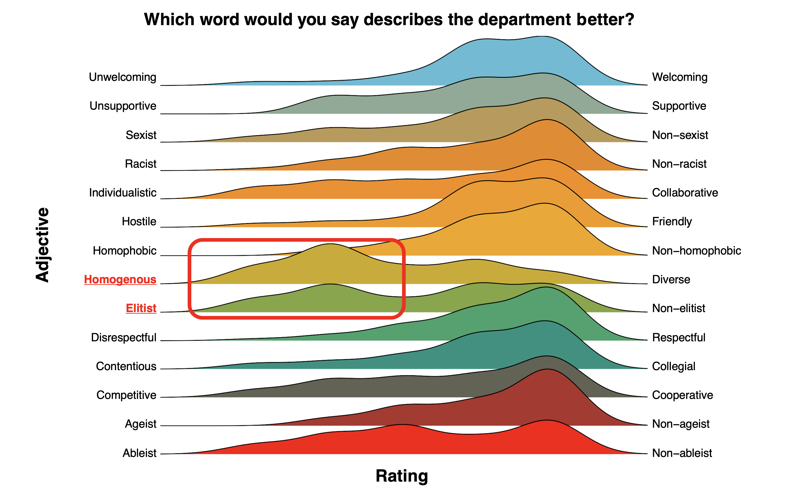

# Spring 2020 Graduate Student Climate Survey Project

## Project Description

This project was conducted in order to gain an understanding of the issues in our program and potential solutions that could be implemented. The project was completely done by graduate students as unpaid labor. The work was conducted by Jack-Morgan Mizell, Da'Mere Wilson, and Andrea Coppola. These files were prepared by Jack-Morgan Mizell. We hope that by keeping a replicable record of this project, we can benefit our program as well as others to reduce the amount of labor required to get a survey like this off the ground. Additionally, the analysis code for this project shows you how to clean and shape data from independent survey questions to make figures like the ones below.

## File List and Descriptions

### ClimateSurveyAnalysis.R

This is the graphing script for the Climate Survey. It outputs all individual graphs which will then need to be manually exported. -Jack-Morgan Mizell did this work.-

### Climate_Survey_Draft.qsf

This is the Qualtrics Survey file with all the questions from the Survey. -This was primarily done by Andrea Coppola with additional work by Da'Mere Wilson and Jack-Morgan Mizell-

### Climate_Survey_Draft.docx

This is a Word version of the Qualtrics Survey file.

### Climate_Survey_Draft_2020_Anon.csv 

This is a csv file of raw data from the Spring 2020 climate survey. All potentially identifying information (including the free response answers) has been removed.

### ClimateSurveyMeeting_05_22_20.pptx

This is the presentation given to the Department Head as well as all program heads in the department. It goes over the main results of the survey. -The presentation was created and given by Da'Mere Wilson and Andrea Coppola.-

### ClimateSurveyMeeting_06_19_2020.pptx

This is the presentation given at the Faculty Meeting to all faculty in attendance. It focuses on Diversity, Equity, and Inclusion with recommendations. -The presentation was created and presented by Jack-Morgan Mizell but heavily based on the 5_22_20 file made by Da'Mere Wilson and Andrea Coppola.-
